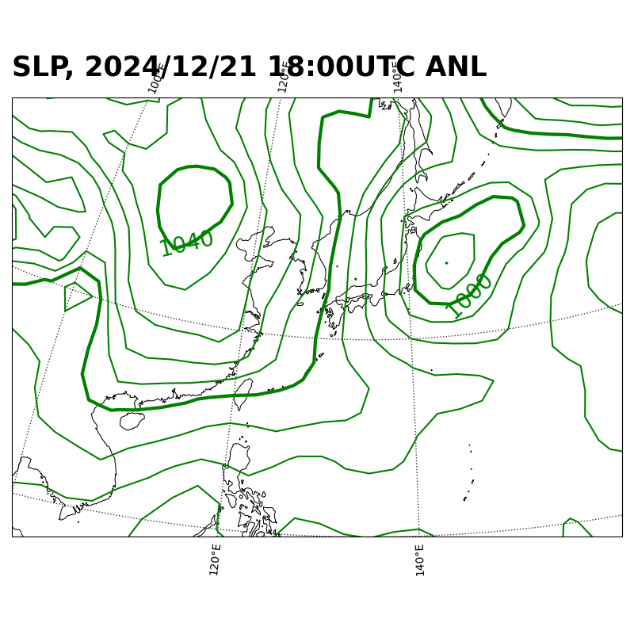

# 天気図の等圧線を4hPaごとに細線，20hPaごとに太線で描く（Python使用）
## 概要
普段目にする天気図は4hPaごとに細線，20hPaごとに太線で描かれることが一般的です．
しかし，ネットや書籍は線の太さを描き分ける方法を紹介していません．
リンク先のブログは線の太さを描き分ける方法
（）を紹介しています．
気になる方は是非参考にしてください．

## 完成天気図


## ソースコードとGPVデータのダウンロード方法（Githubに馴染みのない人向け）
1. 緑の`code`ボタンをクリック
2. Download ZIPボタンをクリックし，zipファイルをダウンロード
3. zipファイルを解凍

## ディレクトリ構成
```
contour-width-adjustment/
├── README.md
├── contour-width-adjust.py # 作図するためのスクリプト
├── contour-width-adjust_slp.png
└── data
    └── GSM_jp-surf_20241221.nc # GPVデータ (NetCDF形式)
```
